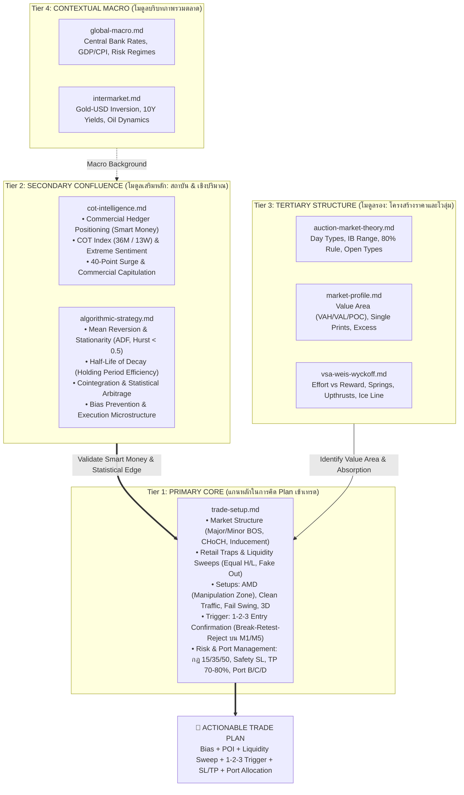

# Trading Brain: Master Architecture & Routing Manifest

คู่มือสถาปัตยกรรมคลังสมองความรู้ (Knowledge Base) สำหรับ AI และเทรดเดอร์ เพื่อใช้เป็นลำดับขั้นในการคิด วิเคราะห์ และวางแผนเข้าเทรดอย่างเป็นระบบ มีหลักการ และมีแต้มต่อสูงสุด

---

## 1. Trading Brain Architecture (ลำดับขั้นการตัดสินใจ)

---

## 2. Standard Operating Procedure (SOP): ขั้นตอนการคิด Plan เข้าเทรด

เมื่อได้รับคำสั่งให้วิเคราะห์ตลาดหรือจัดทำแผนเข้าเทรด AI ต้องคิดตามลำดับขั้น 4 ขั้นตอนนี้เสมอ:

### ขั้นที่ 1: ตรวจสอบบริบทภาพใหญ่ (Tier 4: Macro & Intermarket)
- ดูแนวโน้มเศรษฐกิจมหภาค นโยบายดอกเบี้ย และความสัมพันธ์ระหว่างสินทรัพย์ (เช่น Gold vs USD, Bond Yields) เพื่อทราบว่าตลาดอยู่ในโหมด **Risk-On** หรือ **Risk-Off**

### ขั้นที่ 2: ดึง Confluence เสริมหลัก (Tier 2: COT & Algorithmic Filters)
- **COT Intelligence**: ตรวจสอบการวางสถานะของ Commercial Hedgers (Smart Money) เทียบกับ Large Speculators, ดู COT Index และสัญญาณ 40-Point Surge เพื่อยืนยันว่าทิศทางที่จะเล่นสอดคล้องกับรายใหญ่
- **Algorithmic Strategy**: ตรวจสอบพฤติกรรมราคาเชิงสถิติ — อยู่ในสภาวะ Mean-Reverting หรือ Trending (Hurst Exponent, ADF test), คำนวณ Half-Life เพื่อประเมินระยะเวลาถือครอง position และหลีกเลี่ยง Bias ต่างๆ

### ขั้นที่ 3: ระบุตำแหน่งโครงสร้างและโวลุ่ม (Tier 3: Auction, Market Profile, Wyckoff)
- หาจุดสมดุลราคา Value Area (VAH, VAL, POC), Day Type, Initial Balance จาก Market Profile / Auction Theory
- ตรวจสอบ Volume Absorption, Springs, Upthrusts หรือ Ice Lines จาก Weis-Wyckoff

### ขั้นที่ 4: วางแผนเข้าเทรดด้วยแกนหลัก (Tier 1: `trade-setup.md` - MANDATORY CORE)
- **Structure**: ระบุทิศทางหลักใน HTF (H1/M30), หา Boss Major, CHoCH ที่แท้จริง (มี FVG/Momentum) และ Inducement
- **Liquidity Hunt**: หา Retail Trap (Equal H/L, Trendline liquidity, Double Top/Bottom) ที่รอให้ Smart Money กวาดล้าง
- **Setup Pattern**: เลือกท่าไม้ตายที่เข้ากับหน้างาน (AMD Manipulation Zone, Clean Traffic, Fail Swing, 3D Pattern)
- **Execution Trigger**: ซูมดู LTF (M1/M5) เพื่อรอการยืนยัน **1-2-3 Entry (Break -> Retest -> Reject)** ห้ามเข้าเด็ดขาดถ้าไม่มีการ Confirm
- **Money & Port Management**:
  - กำหนด Safety SL (300-500 จุดสำหรับทองคำ M1)
  - กำหนดเป้าหมาย TP1 ปิดกำไร 70-80% ที่ระยะ 1:1 หรือ 1:1.5
  - ตั้งกันหน้าทุน (Risk-Free) สำหรับออเดอร์ Bonus 20-30% ที่เหลือเพื่อรันเทรนด์ยาว
  - แบ่งพอร์ตตามระดับความเสี่ยง (พอร์ตหลัก Fixed Risk 0.25-1%, พอร์ตลูก B/C/D สำหรับจังหวะ High Risk)

---

## 3. Directory Manifest & Topic Routing Table

| File | Tier | Role | Scope & Primary Topics | Read When |
|---|---|---|---|---|
| [`trade-setup.md`](trade-setup.md) | **Tier 1** | **Primary Core** | SMC, Liquidity Sweeps, AMD, 1-2-3 Entry, Clean Traffic, Fail Swing, 3D, Money Management 15/35/50, Port B/C/D | **ทุกครั้ง** ที่คิด Plan เทรด หรือวิเคราะห์ Price Action / Execution |
| [`cot-intelligence.md`](cot-intelligence.md) | **Tier 2** | **Secondary Confluence** | CFTC, Commercials vs Speculators, Net Position, COT Index, 40-Point Surge, Sentiment Extremes | ต้องการยืนยันเจตนาของ Smart Money รายใหญ่ หรือทิศทางระยะกลาง-ยาว |
| [`algorithmic-strategy.md`](algorithmic-strategy.md) | **Tier 2** | **Secondary Confluence** | Backtesting, Mean Reversion, ADF test, Hurst exponent, Half-Life, Cointegration, Microstructure | ต้องการความได้เปรียบทางสถิติ, Holding time, ตรวจสอบ Bias เชิงปริมาณ |
| [`market-profile.md`](market-profile.md) | **Tier 3** | **Tertiary Structure** | Steidlmayer Method, TPO, Value Area (VAH/VAL/POC), Initial Balance, Excess/Tails | ต้องการหา Key Levels, Value Area, หรือตรวจดูสภาวะเปิดตลาด |
| [`auction-market-theory.md`](auction-market-theory.md) | **Tier 3** | **Tertiary Structure** | Auction Process, Day Types (Trend, Normal, Double Dist), 80% Rule, Open Types | ต้องการจำแนกประเภทของวันเทรด และพฤติกรรมการทดสอบราคา |
| [`vsa-weis-wyckoff.md`](vsa-weis-wyckoff.md) | **Tier 3** | **Tertiary Structure** | Volume Spread Analysis, Wyckoff Schematics, Springs, Upthrusts, Ice Line, Effort vs Reward | ต้องการอ่านแท่งเทียนควบโวลุ่ม, ตรวจจับการดูดซับแรงซื้อ/ขาย |
| [`global-macro.md`](global-macro.md) | **Tier 4** | **Contextual Macro** | Macro Regimes, Central Banks, Policy Rates, Economic Data (CPI/GDP/ISM) | ต้องการประเมินบรรยากาศเศรษฐกิจมหภาค และข่าวตัวเลขสำคัญ |
| [`intermarket.md`](intermarket.md) | **Tier 4** | **Contextual Macro** | Gold-USD inverse correlation, US 10Y Yields, Oil dynamics, Carry trade | ต้องการตรวจสอบความสัมพันธ์ข้ามตลาด (โดยเฉพาะทองคำกับดอลลาร์) |

---

## 4. AI Query & Token Management Rules

1. **Trade Plan Query**: อ่าน `trade-setup.md` เป็นหลักเสมอ หากต้องการเสริมความแม่นยำ ให้อ่าน `cot-intelligence.md` หรือ `algorithmic-strategy.md` รวมไม่เกิน 2-3 ไฟล์ต่อคำถาม
2. **Specific Concept Query**: หากถามเฉพาะเจาะจง (เช่น "COT Index คืออะไร", "Hurst exponent คำนวณอย่างไร") ให้เปิดอ่านเฉพาะไฟล์ที่ตรงกับ Topic ใน Routing Table เท่านั้น
3. **Never Read All Files**: ห้ามเปิดอ่านทั้ง 8 ไฟล์พร้อมกันในคำถามเดียว เพื่อประหยัด Token และป้องกันการหลอน (Hallucination)
4. **Strict Grounding**: ให้ตอบอิงตามหลักการที่ระบุในไฟล์เท่านั้น หากไม่มีข้อมูลให้ตอบว่า "ไม่พบข้อมูลนี้ใน Knowledge Base"
