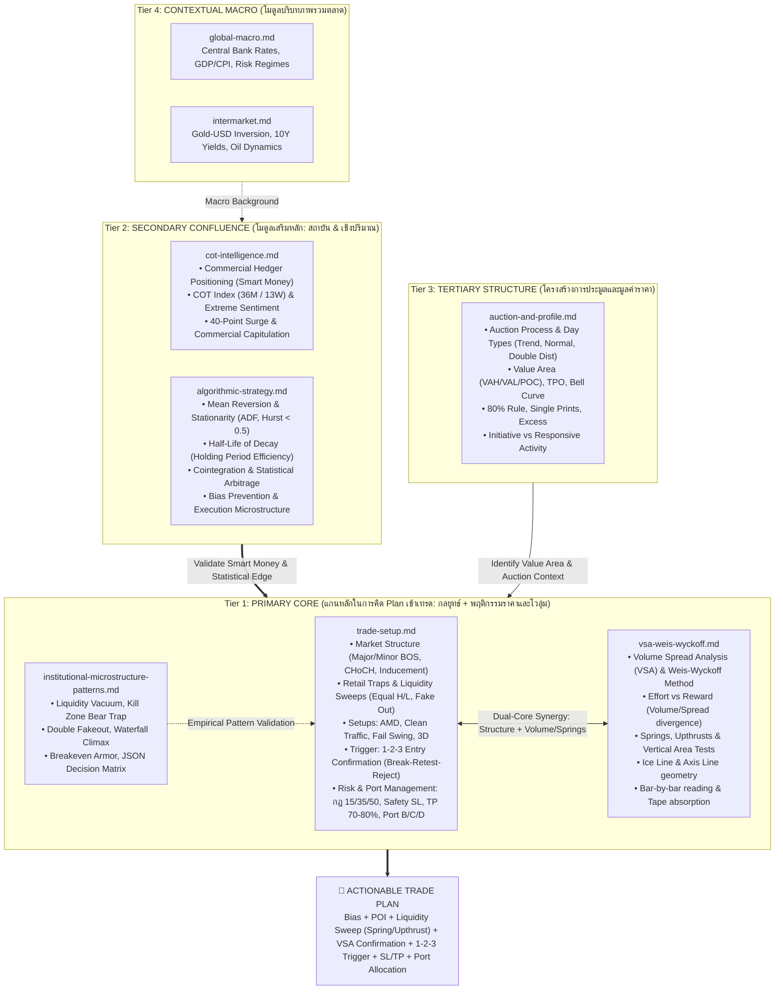

# Trading Brain: Master Architecture & Routing Manifest

คู่มือสถาปัตยกรรมคลังสมองความรู้ (Knowledge Base) สำหรับ AI และเทรดเดอร์ เพื่อใช้เป็นลำดับขั้นในการคิด วิเคราะห์ และวางแผนเข้าเทรดอย่างเป็นระบบ มีหลักการ และมีแต้มต่อสูงสุด

**สินทรัพย์เป้าหมาย:** XAUUSD (Gold), BTCUSD (Bitcoin), USOUSD (Crude Oil)

---

## 1. Trading Brain Architecture (ลำดับขั้นการตัดสินใจ)

---

## 2. Standard Operating Procedure (SOP): ขั้นตอนการคิด Plan เข้าเทรด

เมื่อได้รับคำสั่งให้วิเคราะห์ตลาดหรือจัดทำแผนเข้าเทรด AI ต้องคิดตามลำดับขั้น 4 ขั้นตอนนี้เสมอ:

### ขั้นที่ 1: ตรวจสอบบริบทภาพใหญ่ (Tier 4: Macro & Intermarket)
- ดูแนวโน้มเศรษฐกิจมหภาค นโยบายดอกเบี้ย และความสัมพันธ์ระหว่างสินทรัพย์ (เช่น Gold vs USD, Bond Yields) เพื่อทราบว่าตลาดอยู่ในโหมด **Risk-On** หรือ **Risk-Off**

### ขั้นที่ 2: ดึง Confluence เสริมหลัก (Tier 2: COT & Algorithmic Filters)
- **COT Intelligence**: ตรวจสอบการวางสถานะของ Commercial Hedgers (Smart Money) เทียบกับ Large Speculators, ดู COT Index และสัญญาณ 40-Point Surge เพื่อยืนยันว่าทิศทางที่จะเล่นสอดคล้องกับรายใหญ่
- **Algorithmic Strategy**: ตรวจสอบพฤติกรรมราคาเชิงสถิติ — อยู่ในสภาวะ Mean-Reverting หรือ Trending (Hurst Exponent, ADF test), คำนวณ Half-Life เพื่อประเมินระยะเวลาถือครอง position และหลีกเลี่ยง Bias ต่างๆ

### ขั้นที่ 3: ระบุตำแหน่งโครงสร้างและมูลค่าราคา (Tier 3: Auction & Profile)
- หาจุดสมดุลราคา Value Area (VAH, VAL, POC), Day Type, Initial Balance, 80% Rule จาก `auction-and-profile.md`

### ขั้นที่ 4: วางแผนเข้าเทรดด้วยแกนหลักคู่ (Tier 1: `trade-setup.md` + `vsa-weis-wyckoff.md` - MANDATORY PRIMARY CORES)
- **Structure & Lines**: ระบุทิศทางหลักใน HTF (H1/M30), หา Boss Major, CHoCH, Inducement และตี Ice Line / Axis Line
- **Liquidity Hunt & Springs/Upthrusts**:
  - หา Retail Traps (Equal H/L, Trendline liquidity)
  - ยืนยันการกวาดสภาพคล่องด้วย **Springs** (กวาดล่างแล้วดึงกลับ) หรือ **Upthrusts** (กวาดบนแล้วรูดลง) บน Key Levels / Ice Line
- **Volume & Effort vs. Reward (VSA)**:
  - ตรวจสอบ Volume Spread: แท่งเทียนที่วิ่งแรงต้องมีโวลุ่มสนับสนุน (Effort vs Result)
  - หาการดูดซับแรงซื้อ/ขาย (Absorption) และการชะลอตัวของแรงส่ง (Shortening of Thrust - SOT)
- **Setup Pattern**: เลือกท่าสังหาร (AMD Manipulation Zone, Clean Traffic, Fail Swing, 3D Pattern)
- **Execution Trigger**: ซูมดู LTF (M1/M5) เพื่อรอการยืนยัน **1-2-3 Entry (Break -> Retest -> Reject)**:
  - จังหวะ **Retest** ต้องยืนยันด้วย **Low Volume Test** หรือ Vertical Area Test เพื่อยืนยันว่าไม่มีแรงขาย/ซื้อสวนทาง
- **Money & Port Management**:
  - กำหนด Safety SL (300-500 จุดสำหรับทองคำ M1)
  - กำหนดเป้าหมาย TP1 ปิดกำไร 70-80% ที่ระยะ 1:1 หรือ 1:1.5
  - ตั้งกันหน้าทุน (Risk-Free) สำหรับออเดอร์ Bonus 20-30% ที่เหลือเพื่อรันเทรนด์ยาว
  - แบ่งพอร์ตตามระดับความเสี่ยง (พอร์ตหลัก Fixed Risk 0.25-1%, พอร์ตลูก B/C/D สำหรับจังหวะ High Risk)

---

## 3. Directory Manifest & Topic Routing Table

| File | Tier | Role | Reading Mode | Scope & Primary Topics | Read When |
|---|---|---|---|---|---|
| [`trade-setup.md`](trade-setup.md) | **Tier 1** | **Primary Core (Execution Playbook)** | `hybrid` | SMC, Liquidity Sweeps, AMD, 1-2-3 Entry, Clean Traffic, Fail Swing, 3D, Money Management 15/35/50, Port B/C/D | **ทุกครั้ง** ที่คิด Plan เทรด หรือวิเคราะห์ Price Action / Execution |
| [`vsa-weis-wyckoff.md`](vsa-weis-wyckoff.md) | **Tier 1** | **Primary Core (Price-Volume & VSA)** | `hybrid` | Volume Spread Analysis, Weis-Wyckoff, Springs, Upthrusts, Ice Line, Effort vs Reward, Bar reading, Absorption | **ทุกครั้ง** ที่คิด Plan เทรด เพื่ออ่านโวลุ่มควบราคา, ยืนยันการ Sweep, และตรวจจังหวะ Test |
| [`institutional-microstructure-patterns.md`](institutional-microstructure-patterns.md) | **Tier 1** | **Empirical Patterns (Live Microstructure)** | `standalone` | Liquidity Vacuum, Kill Zone Bear Trap, Double Fakeout Ping-Pong, Waterfall Climax, Breakeven Armor, JSON schema | วิเคราะห์ Order Book Flow, สภาวะสูญญากาศ, ดักจังหวะ Trap สถาบัน และบริหาร SL หน้าทุน |
| [`cot-intelligence.md`](cot-intelligence.md) | **Tier 2** | **Secondary Confluence** | `hybrid` | CFTC, Commercials vs Speculators, Net Position, COT Index, 40-Point Surge, Sentiment Extremes | ต้องการยืนยันเจตนาของ Smart Money รายใหญ่ หรือทิศทางระยะกลาง-ยาว |
| [`algorithmic-strategy.md`](algorithmic-strategy.md) | **Tier 2** | **Secondary Confluence** | `standalone` | Backtesting, Mean Reversion, ADF test, Hurst exponent, Half-Life, Cointegration, Microstructure | ต้องการความได้เปรียบทางสถิติ, Holding time, ตรวจสอบ Bias เชิงปริมาณ |
| [`auction-and-profile.md`](auction-and-profile.md) | **Tier 3** | **Tertiary Structure (Unified)** | `hybrid` | Auction Process, Day Types, Value Area (VAH/VAL/POC), TPO, 80% Rule, Open Types, Initiative vs Responsive, Single Prints, Excess | ต้องการหา Key Levels, Value Area, Day Type, สภาวะเปิดตลาด, หรือพฤติกรรมการทดสอบราคา |
| [`global-macro.md`](global-macro.md) | **Tier 4** | **Contextual Macro** | `hybrid` | Macro Regimes, Central Banks, Policy Rates, Economic Data (CPI/GDP/ISM) | ต้องการประเมินบรรยากาศเศรษฐกิจมหภาค และข่าวตัวเลขสำคัญ |
| [`intermarket.md`](intermarket.md) | **Tier 4** | **Contextual Macro** | `hybrid` | Gold-USD inverse correlation, US 10Y Yields, Oil dynamics, Carry trade | ต้องการตรวจสอบความสัมพันธ์ข้ามตลาด (โดยเฉพาะทองคำกับดอลลาร์) |

---

## 4. Reading Mode Guide (คู่มือการอ่านสำหรับ AI)

แต่ละไฟล์มี `reading_mode` ใน YAML frontmatter เพื่อบอก AI ว่าควรอ่านแบบไหน:

| Mode | ความหมาย | วิธีอ่าน |
|------|---------|---------|
| `sequential` | เนื้อหาต้องอ่าน **เรียงลำดับ** — แต่ละ section ต่อเนื่องกัน | อ่านจาก section 1 ไปจนจบ ห้ามข้าม |
| `standalone` | แต่ละ section **เป็นอิสระ** — อ่านแยกได้ | ใช้ grep หา topic ที่ต้องการ อ่านเฉพาะ section นั้น |
| `hybrid` | มีทั้ง sequential และ standalone sections | ดู `sequential_sections` และ `standalone_sections` ใน frontmatter เพื่อตัดสินใจ |

---

## 5. AI Query & Token Management Rules

1. **Trade Plan Query**: อ่าน Tier 1 Cores (`trade-setup.md` และ `vsa-weis-wyckoff.md`) เป็นหลักเสมอ เสริมด้วย Confluence จาก Tier 2 รวมไม่เกิน 2-3 ไฟล์ต่อคำถาม
2. **Specific Concept Query**: หากถามเฉพาะเจาะจง ให้เปิดอ่านเฉพาะไฟล์ที่ตรงกับ Topic ใน Routing Table เท่านั้น
3. **Never Read All Files**: ห้ามเปิดอ่านทั้ง 8 ไฟล์พร้อมกันในคำถามเดียว เพื่อประหยัด Token และป้องกันการหลอน (Hallucination)
4. **Use Reading Mode**: ตรวจสอบ `reading_mode` ใน frontmatter ก่อนอ่าน — ถ้า `standalone` ใช้ grep หา section ที่ต้องการแทนการอ่านทั้งไฟล์
5. **Strict Grounding**: ให้ตอบอิงตามหลักการที่ระบุในไฟล์เท่านั้น หากไม่มีข้อมูลให้ตอบว่า "ไม่พบข้อมูลนี้ใน Knowledge Base"
