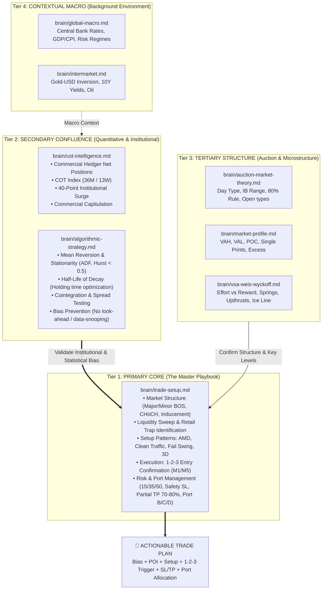

# Plan: Brain Trading Hierarchy & `marker-analyzer` Skill Optimization

## 1. Objective

Establish a structured, hierarchical trade planning architecture across `brain/` and `.agents/skills/marker-analyzer/SKILL.md`:
1. **Primary Core (`brain/trade-setup.md`)**: The central playbook and execution blueprint for all trade setups (Market Structure, Liquidity Sweeps, AMD Pattern, 1-2-3 Entry Confirmation, Risk Management 15/35/50, Port Splitting).
2. **Secondary Confluence (`brain/cot-intelligence.md` & `brain/algorithmic-strategy.md`)**: Quantitative and institutional filters that validate directional bias (COT Smart Money/Commercials, 40-point surge) and statistical edge (Mean reversion, stationarity, half-life decay, microstructure rigor).
3. **Tertiary Subordinate Layer (Market Profile, Auction Market Theory, VSA/Wyckoff)**: Key volume levels, Value Areas (VAH/VAL/POC), Day Types, and bar-by-bar absorption.
4. **Context Layer (Global Macro, Intermarket)**: Macro regimes, policy rates, and Gold/USD/Yield correlations.

---

## 2. Trading Plan Formulation Hierarchy (Mermaid Diagram)



---

## 3. Step-by-Step Trade Plan Formulation Protocol

When the AI creates or evaluates a trade plan, it MUST follow this 4-step sequence:

```
Step 1: Background & Macro Check (Tier 4)
  └─ Gold/USD correlation, Yield dynamics, Central Bank bias.

Step 2: Confluence & Statistical Filters (Tier 2)
  ├─ COT: Are Commercial Hedgers aligned? Any 40-point surge or extreme positioning?
  └─ Algo: Is price in a mean-reverting regime (Hurst < 0.5)? What is the half-life?

Step 3: Structural & Profile Location (Tier 3)
  └─ Where is price relative to VAH/VAL/POC, Initial Balance, or Wyckoff Ice/Axis line?

Step 4: CORE EXECUTION BLUEPRINT (Tier 1 - trade-setup.md) [MANDATORY]
  ├─ Structure: Identify Major/Minor BOS, CHoCH, and Inducement
  ├─ Liquidity Target: Where is the Retail Trap / Stop Hunt happening?
  ├─ Pattern: Identify AMD Manipulation Zone, Clean Traffic, Fail Swing, or 3D
  ├─ Trigger: Confirm via 1-2-3 Entry (Break -> Retest -> Reject on M1/M5)
  └─ Risk Blueprint: Fixed Risk 0.25-1%, Safety SL 300-500 pts, Partial Close 70-80% at 1:1-1.5, Run 20-30% Risk-Free, Port B/C/D allocation
```

---

## 4. File Changes Summary

### Component 1: `brain/README.md` [NEW]
Create a master index and routing file documenting:
- The 4-Tier Hierarchy (Core -> Secondary Confluence -> Tertiary Structure -> Context)
- Trade Plan Formulation Protocol
- Quick Routing Table (Topic -> File -> Priority)
- Token budget rules for efficient lookup

### Component 2: YAML Frontmatter Updates across `brain/`
- **`brain/trade-setup.md`**: Add frontmatter with `role: primary-core`, `priority: 1`, `layer: 0-core-execution`.
- **`brain/cot-intelligence.md`**: Update frontmatter with `role: secondary-confluence`, `priority: 2`.
- **`brain/algorithmic-strategy.md`**: Add frontmatter with `role: secondary-confluence`, `priority: 2`.
- **`brain/auction-market-theory.md`**, **`brain/market-profile.md`**, **`brain/vsa-weis-wyckoff.md`**: Update frontmatter with `role: tertiary-structure`, `priority: 3`.
- **`brain/global-macro.md`**, **`brain/intermarket.md`**: Update frontmatter with `role: contextual-macro`, `priority: 4`.

### Component 3: Skill `.agents/skills/marker-analyzer/SKILL.md` [MODIFY]
- Update instructions to anchor trade planning directly on `brain/trade-setup.md`.
- Define the two-phase routing:
  1. For Trade Planning queries: Load `trade-setup.md` as primary, cross-reference `cot-intelligence.md` and `algorithmic-strategy.md` as confluence.
  2. For Specific Concept queries: Target the specific file directly using the lookup table.
- Replace all outdated filenames (`Algorithmic Strategy Framework.md`, etc.) with current kebab-case filenames.
- Enforce token-efficient output guidelines and hallucination guardrails.

---

## 5. Verification Plan

1. Confirm YAML frontmatter in all 8 brain files is valid and cleanly separated from content.
2. Confirm `brain/README.md` accurately represents the hierarchy and routing paths.
3. Validate `.agents/skills/marker-analyzer/SKILL.md` has updated filenames, priority rules, and execution protocol.
4. Verify zero loss or corruption of existing analytical knowledge across all files.
