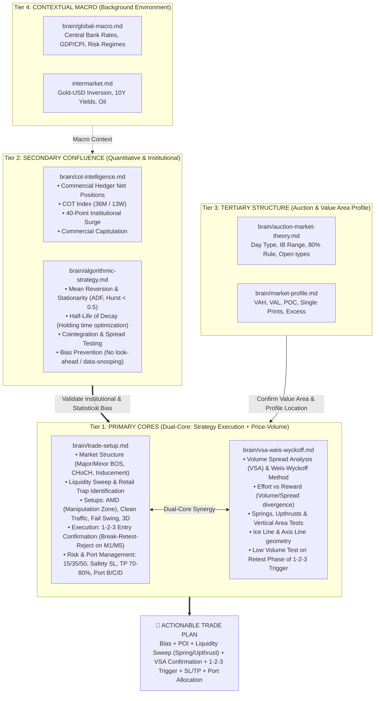

# Plan: Brain Trading Hierarchy & `marker-analyzer` Skill Optimization

## 1. Objective

Establish a structured, hierarchical trade planning architecture across `brain/` and `.agents/skills/marker-analyzer/SKILL.md`:
1. **Tier 1: Primary Cores (Dual-Core Execution & Price-Volume Engine)**:
   - **`brain/trade-setup.md`**: Central playbook and execution blueprint (Market Structure, Liquidity Sweeps, AMD Pattern, 1-2-3 Entry Confirmation, Risk Management 15/35/50, Port Splitting).
   - **`brain/vsa-weis-wyckoff.md`**: Core Volume Spread Analysis (VSA), Effort vs Reward, Springs/Upthrusts validating sweeps, Ice Line geometry, Bar-by-bar absorption, Low-volume tests.
2. **Tier 2: Secondary Confluence (`brain/cot-intelligence.md` & `brain/algorithmic-strategy.md`)**:
   - Quantitative and institutional filters validating directional bias (COT Smart Money/Commercials, 40-point surge) and statistical edge (Mean reversion, stationarity, half-life decay, microstructure rigor).
3. **Tier 3: Tertiary Structure (`brain/auction-market-theory.md` & `brain/market-profile.md`)**:
   - Value Areas (VAH/VAL/POC), Day Types, Initial Balance (IB Range & Extension), and Excess/Tails.
4. **Tier 4: Context Layer (`brain/global-macro.md` & `brain/intermarket.md`)**:
   - Macro regimes, policy rates, inflation, and Gold/USD/Yield correlations.

---

## 2. Trading Plan Formulation Hierarchy (Mermaid Diagram)



---

## 3. Step-by-Step Trade Plan Formulation Protocol

```
Step 1: Background & Macro Check (Tier 4)
  └─ Gold/USD correlation, Yield dynamics, Central Bank bias.

Step 2: Confluence & Statistical Filters (Tier 2)
  ├─ COT: Are Commercial Hedgers aligned? Any 40-point surge or extreme positioning?
  └─ Algo: Is price in a mean-reverting regime (Hurst < 0.5)? What is the half-life?

Step 3: Value Area & Auction Structure (Tier 3)
  └─ Where is price relative to VAH/VAL/POC and Initial Balance?

Step 4: DUAL-CORE EXECUTION BLUEPRINT (Tier 1: trade-setup.md + vsa-weis-wyckoff.md) [MANDATORY]
  ├─ Structure: Major/Minor BOS, CHoCH, Inducement + Ice Line / Axis Line geometry
  ├─ Sweep & Action Signals: Retail traps verified by Wyckoff Springs or Upthrusts
  ├─ Volume Spread Validation: Effort vs Reward, Bar absorption, Shortening of Thrust (SOT)
  ├─ Setup: AMD Manipulation Zone, Clean Traffic, Fail Swing, or 3D Pattern
  ├─ Execution Trigger: 1-2-3 Entry (Break -> Retest [Low Volume Test] -> Reject)
  └─ Risk Blueprint: Fixed Risk 0.25-1%, Safety SL 300-500 pts, Partial Close 70-80% at 1:1-1.5, Run 20-30% Risk-Free, Port B/C/D allocation
```

---

## 4. Verification & Status

- [x] Renamed brain files to kebab-case and deleted duplicate.
- [x] Translated `trade-setup.md` to English (~41% byte reduction, ~60-70% token savings).
- [x] Added `vsa-weis-wyckoff.md` to Tier 1 Primary Cores alongside `trade-setup.md`.
- [x] Updated `brain/README.md` with Dual-Core Tier 1 Architecture.
- [x] Updated `.agents/skills/marker-analyzer/SKILL.md` with Dual-Core Tier 1 Execution SOP.
