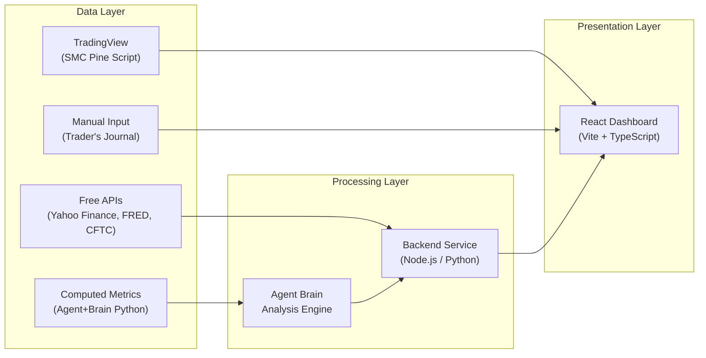
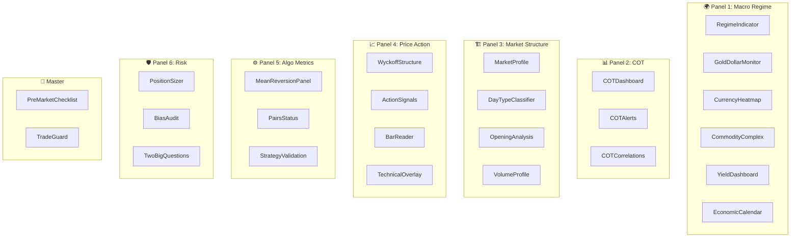

# Professional Trading Dashboard — Implementation Plan

> [!NOTE]
> แผนนี้แบ่งงานจาก [dashboard_data_summary.md](file:///Users/masada.h/Desktop/Personal/Project/trade-setup/plan/dashboard_data_summary.md) (~92 data points, 6 panels) ออกเป็น work packages ที่ชัดเจน พร้อมระบุแหล่งข้อมูล, API, วิธีคำนวณ, และส่วนไหนที่ Agent+Brain วิเคราะห์ ส่วนไหนที่ Day Trader ดูตาได้เลย

---

## สถาปัตยกรรมระดับสูง (High-Level Architecture)



---

## Data Source Matrix — ดึงข้อมูลจากไหนบ้าง

### 🔑 แหล่งข้อมูลหลัก

| Source ID | ชื่อแหล่งข้อมูล | ประเภท | ค่าใช้จ่าย | รองรับ Panel |
|---|---|---|---|---|
| **DS-1** | **Yahoo Finance API** (`yfinance` / unofficial REST) | Price Data, FX, Commodities | ฟรี | 1, 4 |
| **DS-2** | **FRED API** (Federal Reserve Economic Data) | Interest Rates, Yield Curve, Economic Indicators | ฟรี (API key) | 1 |
| **DS-3** | **CFTC COT Reports** (quandl.com / cftc.gov CSV) | COT positioning data | ฟรี | 2 |
| **DS-4** | **Alpha Vantage** (fallback for FX & Commodities) | Price Data | ฟรี (5 calls/min) | 1, 4 |
| **DS-5** | **Agent+Brain Computation** (Python scripts in `/brain/`) | Statistical metrics, regime classification | ฟรี (local compute) | 1, 3, 5 |
| **DS-6** | **TradingView + SMC Pine Script** ([smc.pine](file:///Users/masada.h/Desktop/Personal/Project/trade-setup/indicator/smc.pine)) | Chart overlay signals | ฟรี (TradingView account) | 4 |
| **DS-7** | **Manual Trader Input** (UI forms) | Bias Audit, Journal entries | ฟรี | 6 |
| **DS-8** | **Investing.com / ForexFactory** (web scrape or RSS) | Economic Calendar | ฟรี | 1 |

---

## Phase 1: Foundation & Infrastructure

### Work Package 1.1 — Project Setup & Design System

| รายละเอียด | |
|---|---|
| **เป้าหมาย** | วางโครงสร้าง React app, routing, design tokens, layout grid สำหรับ 6-panel dashboard |
| **ไฟล์ที่สร้าง/แก้ไข** | `src/index.css`, `src/App.tsx`, `src/main.tsx`, `index.html` |
| **Dependencies ใหม่** | `react-router-dom`, `lightweight-charts` (TradingView charting), `recharts` (for gauges & heatmaps) |

**งาน:**
- [ ] ออกแบบ Design System: color tokens (dark theme สำหรับ trader), typography scale, spacing
- [ ] สร้าง responsive grid layout — 6 panels ไหลจาก top→bottom (macro→execution)
- [ ] สร้าง Sidebar navigation + panel switcher
- [ ] ตั้งค่า React Router สำหรับ panel-level routing (`/macro`, `/cot`, `/structure`, `/price-action`, `/algo`, `/risk`)

---

### Work Package 1.2 — Data Service Layer

| รายละเอียด | |
|---|---|
| **เป้าหมาย** | สร้าง backend service / API proxy เพื่อดึงข้อมูลจากแหล่งต่างๆ มารวมไว้ที่เดียว |
| **ไฟล์ที่สร้าง** | `src/services/api.ts`, `src/services/yahoo.ts`, `src/services/fred.ts`, `src/services/cot.ts` |

**งาน:**
- [ ] สร้าง API client wrapper สำหรับ Yahoo Finance (XAU/USD, DXY, WTI, Copper, Currencies)
- [ ] สร้าง API client สำหรับ FRED (Fed Funds Rate, Yield Curve, CPI, GDP)
- [ ] สร้าง COT data parser (CSV/JSON from CFTC)
- [ ] สร้าง data cache layer (localStorage + TTL) เพื่อลด API calls
- [ ] สร้าง WebSocket/polling mechanism สำหรับ near-realtime price updates

---

## Phase 2: Panel 1 — Macro Regime & Intermarket (22 data points)

> **ใครวิเคราะห์:** Agent+Brain (regime classification, correlation computation) + Trader ดูตา (heatmap, price levels)
> **แหล่งข้อมูล:** DS-1 (Yahoo Finance), DS-2 (FRED), DS-5 (Agent computation), DS-8 (Calendar)

### Work Package 2.1 — Regime Indicator Widget

| Data Point | แหล่งข้อมูล | วิธีได้มา | ใครวิเคราะห์ |
|---|---|---|---|
| Current Regime Label (Growth/Inflation/Crisis) | DS-5 Agent+Brain | Agent วิเคราะห์จาก GDP trend + CPI + yield curve inversion + equity/gold ratio แล้ว classify เป็น regime | 🤖 Agent |
| Impossible Trinity Filter | DS-5 Agent+Brain | Agent ประเมินจากนโยบาย CB แต่ละแห่ง (manual knowledge + recent policy data) | 🤖 Agent |

**Component:** `<RegimeIndicator />` — แสดง badge (Growth 🟢 / Inflation 🟡 / Crisis 🔴) + Impossible Trinity diagram

### Work Package 2.2 — Gold-Dollar Correlation Monitor

| Data Point | แหล่งข้อมูล | วิธีได้มา | ใครวิเคราะห์ |
|---|---|---|---|
| Gold (XAU/USD) Price — Live | DS-1 Yahoo Finance | `fetch('https://query1.finance.yahoo.com/v8/finance/chart/GC=F')` | 👁️ Trader ดูตา |
| DXY (US Dollar Index) — Live | DS-1 Yahoo Finance | `fetch('...chart/DX-Y.NYB')` | 👁️ Trader ดูตา |
| Gold-USD Rolling Correlation (30-day) | DS-5 Agent compute | คำนวณ Pearson correlation จาก 30-day close prices ของทั้งคู่ | 🤖 Agent คำนวณ → 👁️ Trader ดูค่า |
| Correlation Status Flag | DS-5 Agent compute | if correlation > 0 → 🔴 Decoupled, else 🟢 Normal | 🤖 Auto-flag |

**Component:** `<GoldDollarMonitor />` — dual-line chart + correlation gauge + status flag

### Work Package 2.3 — Currency Strength Heatmap

| Data Point | แหล่งข้อมูล | วิธีได้มา | ใครวิเคราะห์ |
|---|---|---|---|
| Currency vs Gold Performance (8 currencies) | DS-1 Yahoo Finance | ดึง XAU/{CCY} สำหรับ AUD, CAD, NZD, EUR, GBP, JPY, CHF, USD แล้วคำนวณ % change | 🤖 Agent คำนวณ |
| Strongest/Weakest Pair Highlight | DS-5 Agent compute | sort by % change → highlight top & bottom | 🤖 Auto-highlight → 👁️ Trader ดูตา |
| JPY Strength Meter | DS-1 + DS-5 | USD/JPY + cross-pairs performance → normalized meter | 🤖 Agent คำนวณ |

**Component:** `<CurrencyHeatmap />` — 8-cell heatmap grid, color-coded green→red

### Work Package 2.4 — Commodity & Energy Complex

| Data Point | แหล่งข้อมูล | วิธีได้มา | ใครวิเคราะห์ |
|---|---|---|---|
| WTI Crude Oil Price — Live | DS-1 Yahoo Finance | `CL=F` | 👁️ Trader ดูตา |
| CAD/WTI Correlation | DS-5 Agent compute | Rolling correlation CAD vs WTI | 🤖 Agent → dislocation alert |
| Copper + Copper/CLP Correlation | DS-1 + DS-5 | `HG=F` + CLP computation | 🤖 Agent → dislocation alert |
| Equity/Gold Ratio | DS-1 + DS-5 | S&P500 / Gold price ratio + secular trend analysis | 🤖 Agent คำนวณ → 👁️ Trader ดูตา |

**Component:** `<CommodityComplex />` — price cards + correlation status badges

### Work Package 2.5 — Interest Rate & Yield Differentials

| Data Point | แหล่งข้อมูล | วิธีได้มา | ใครวิเคราะห์ |
|---|---|---|---|
| Fed Funds Rate | DS-2 FRED | `FEDFUNDS` series | 👁️ Trader ดูตา |
| ECB, BOJ, BOE, RBA Policy Rates | DS-2 FRED / Manual | FRED series or manual update | 👁️ Trader ดูตา |
| Yield Differential Spread | DS-5 Agent compute | Fed rate - each CB rate → is it expanding? | 🤖 Agent คำนวณ + trend arrow |
| US Yield Curve (2Y/10Y Spread) | DS-2 FRED | `GS2` - `GS10` series | 🤖 Auto → inversion alert 🔴 |
| Interest Rate Swap Rates | DS-2 FRED | `DSWP*` series | 👁️ Trader ดูตา |

**Component:** `<YieldDashboard />` — rate table + yield curve chart + differential bars

### Work Package 2.6 — Economic Calendar & CB Monitor

| Data Point | แหล่งข้อมูล | วิธีได้มา | ใครวิเคราะห์ |
|---|---|---|---|
| Upcoming Data Releases | DS-8 ForexFactory/Investing.com | Scrape or RSS → structured calendar | 👁️ Trader ดูตา |
| Baltic Dry Index | DS-1 Yahoo Finance / DS-2 FRED | `BDIY` or FRED equivalent | 👁️ Trader ดูตา |
| Central Bank Schedule | DS-8 | Manual / scraped calendar | 👁️ Trader ดูตา |
| QE / Balance Sheet Status | DS-2 FRED | `WALCL` (Fed balance sheet) | 🤖 Agent track trend |

**Component:** `<EconomicCalendar />` — timeline view with impact flags (🔴 High, 🟡 Med, 🟢 Low)

---

## Phase 3: Panel 2 — COT & Institutional Positioning (14 data points)

> **ใครวิเคราะห์:** 🤖 Agent+Brain เป็นหลัก (คำนวณ COT Index, Movement Index, extremes)  
> **แหล่งข้อมูล:** DS-3 (CFTC COT Reports)

### Work Package 3.1 — COT Index Dashboard

| Data Point | แหล่งข้อมูล | วิธีได้มา | ใครวิเคราะห์ |
|---|---|---|---|
| Commercial Net Position | DS-3 CFTC | Parse weekly COT report CSV → Longs - Shorts | 🤖 Agent parse |
| Large Speculator Net Position | DS-3 CFTC | Same CSV, "Non-Commercial" column | 🤖 Agent parse |
| Small Trader Net Position | DS-3 CFTC | "Non-reportable" column | 🤖 Agent parse |
| COT Index (36-month lookback) | DS-5 Agent compute | `(Current Net - Min) / (Max - Min) × 100` over 36 months | 🤖 Agent คำนวณ |
| COT Index (13-week lookback) | DS-5 Agent compute | Same formula, 13-week window | 🤖 Agent คำนวณ |
| COT Movement Index | DS-5 Agent compute | Week-to-week Δ in COT Index → flag if ≥ +40 | 🤖 Agent + 🚨 Alert |

**Component:** `<COTDashboard />` — stacked area chart (3 groups) + COT Index gauges + Movement Index bar

### Work Package 3.2 — Extreme Consensus Alerts

| Data Point | แหล่งข้อมูล | วิธีได้มา | ใครวิเคราะห์ |
|---|---|---|---|
| Commercial COT Index at 100% | DS-5 | Threshold check on computed COT Index | 🤖 Auto-alert 🟢 |
| Commercial COT Index at 0% | DS-5 | Threshold check | 🤖 Auto-alert 🔴 |
| Mirror Image Divergence | DS-5 | Compare Commercial vs Large Spec direction | 🤖 Agent detect → flag |
| Speculative Crowding Alert | DS-3 + DS-5 | Extreme Large Spec position + low diversity | 🤖 Auto-alert ⚠️ |

**Component:** `<COTAlerts />` — alert cards with severity levels

### Work Package 3.3 — Cross-Market COT Correlations

| Data Point | แหล่งข้อมูล | วิธีได้มา | ใครวิเคราะห์ |
|---|---|---|---|
| Energy COT → APA, PDS equities | DS-3 + DS-1 | COT Energy data + equity prices | 🤖 Agent correlate |
| Metals COT → GLD, SLV | DS-3 + DS-1 | COT Metals + ETF prices | 🤖 Agent correlate |
| Rates COT → TLT | DS-3 + DS-1 | COT Rates + TLT price | 🤖 Agent correlate |
| Currency COT → Spot FOREX | DS-3 + DS-1 | COT FX + spot rates | 🤖 Agent correlate |

**Component:** `<COTCorrelations />` — correlation matrix table with status indicators

---

## Phase 4: Panel 3 — Market Structure & Profile (16 data points)

> **ใครวิเคราะห์:** ผสม — 🤖 Agent คำนวณ TPO/Value Area + 👁️ Trader อ่าน Profile shape ดูตา  
> **แหล่งข้อมูล:** DS-1 (Yahoo Finance intraday data), DS-5 (Agent computation)

### Work Package 4.1 — Market Profile (TPO)

| Data Point | แหล่งข้อมูล | วิธีได้มา | ใครวิเคราะห์ |
|---|---|---|---|
| TPO Profile (current session) | DS-1 + DS-5 | Agent สร้าง TPO จาก 30-min bars (intraday data) | 🤖 Agent สร้าง → 👁️ Trader อ่าน |
| Value Area (VAH, VAL, POC) | DS-5 Agent compute | คำนวณ 68% zone จาก TPO distribution | 🤖 Agent คำนวณ |
| Previous Day's Value Area | DS-5 | Store yesterday's VA | 🤖 Auto-carry |
| Profile Shape | DS-5 | Agent classify: fat (balanced) vs thin (trending) | 🤖 Agent classify → 👁️ Trader confirm |
| Single Prints / Tails | DS-5 | Detect single-TPO levels in profile | 🤖 Agent detect |
| Excesses / Blow-Off Extremes | DS-5 | Detect rapid rejection at extremes | 🤖 Agent detect |
| Auction Points | DS-5 | Identify where auction fully reversed | 🤖 Agent detect |

**Component:** `<MarketProfile />` — horizontal TPO chart + Value Area overlay + annotations

### Work Package 4.2 — Day Type Classification

| Data Point | แหล่งข้อมูล | วิธีได้มา | ใครวิเคราะห์ |
|---|---|---|---|
| Detected Day Type | DS-5 Agent compute | Classify from IB range, extension patterns, profile shape | 🤖 Agent classify |
| Initial Balance Range | DS-1 | First 60-min high/low from intraday data | 🤖 Auto-compute |
| Range Extension Count | DS-1 + DS-5 | Count extensions above/below IB | 🤖 Auto-compute |

**Component:** `<DayTypeClassifier />` — day type badge + IB range ruler + extension counter

### Work Package 4.3 — Opening Analysis

| Data Point | แหล่งข้อมูล | วิธีได้มา | ใครวิเคราะห์ |
|---|---|---|---|
| Opening Relationship | DS-1 + DS-5 | Compare open price to previous VA → within/outside/gap | 🤖 Agent classify |
| Value Area Rule Status | DS-5 | Track if price re-entered VA → 80% probability flag | 🤖 Agent → 👁️ Trader alert |
| Gap Status & Direction | DS-1 | Compare today's open to yesterday's range | 🤖 Auto-compute |

**Component:** `<OpeningAnalysis />` — opening relationship badge + VA rule tracker

### Work Package 4.4 — Volume Area Analysis

| Data Point | แหล่งข้อมูล | วิธีได้มา | ใครวิเคราะห์ |
|---|---|---|---|
| High-Volume Nodes (HVN) | DS-1 + DS-5 | Volume profile analysis → identify price levels with highest volume | 🤖 Agent compute |
| Low-Volume Nodes (LVN) | DS-1 + DS-5 | Inverse of HVN — price levels with minimal volume | 🤖 Agent compute |
| Initiative vs Responsive Flag | DS-5 | Agent analyze buying/selling relative to previous VA | 🤖 Agent classify → 👁️ Trader ดู |

**Component:** `<VolumeProfile />` — horizontal volume histogram + HVN/LVN annotations

---

## Phase 5: Panel 4 — Price Action & Volume Analysis (22 data points)

> **ใครวิเคราะห์:** ส่วนใหญ่ 👁️ Trader ดูตา + 🤖 Agent detect signals  
> **แหล่งข้อมูล:** DS-1 (Price data), DS-5 (Agent pattern detection), DS-6 (TradingView SMC)

### Work Package 5.1 — Weis-Wyckoff Structural Lines

| Data Point | แหล่งข้อมูล | วิธีได้มา | ใครวิเคราะห์ |
|---|---|---|---|
| Support / Resistance Lines | DS-6 SMC Pine + DS-5 | Pine script on TradingView + Agent detect from historical pivots | 🤖 Agent detect + 👁️ Trader draw |
| Ice Line | DS-5 | Agent identify range floor | 🤖 Agent detect |
| Axis Lines | DS-5 | Agent detect S/R flip levels | 🤖 Agent detect |
| Trend Channels | DS-5 | Agent compute demand/supply lines | 🤖 Agent compute → 👁️ overlay |
| Reverse Trend Channel | DS-5 | Agent draw reverse channel for exhaustion alert | 🤖 Agent compute |
| Converging Lines / Apex | DS-5 | Agent detect narrowing amplitude | 🤖 Agent detect → ⚠️ alert |

**Component:** `<WyckoffStructure />` — interactive chart with line overlays (ใช้ lightweight-charts)

### Work Package 5.2 — Action Signals

| Data Point | แหล่งข้อมูล | วิธีได้มา | ใครวิเคราะห์ |
|---|---|---|---|
| Springs (false breakdowns) | DS-5 + DS-6 | Agent detect from price pattern + SMC Pine | 🤖 Agent → 🏷️ label on chart |
| Upthrusts (false breakouts) | DS-5 + DS-6 | Same reverse pattern detection | 🤖 Agent → 🏷️ label on chart |
| Shortening of Thrust (SOT) | DS-5 | Agent compare delta between successive waves | 🤖 Agent คำนวณ |
| Absorption Zones | DS-5 | High volume + little price progress detection | 🤖 Agent detect |
| Tests | DS-5 | Return to high-vol area on low volume | 🤖 Agent detect |
| Hinge / Dead Center | DS-5 | Maximum compression detection | 🤖 Agent detect → ⚠️ imminent move |

**Component:** `<ActionSignals />` — signal list + chart annotations

### Work Package 5.3 — Bar-by-Bar Reading

| Data Point | แหล่งข้อมูล | วิธีได้มา | ใครวิเคราะห์ |
|---|---|---|---|
| Bar Spread (wide/narrow) | DS-1 | high - low per bar | 🤖 Auto-compute → 👁️ Trader อ่าน |
| Close Position | DS-1 | (close - low) / (high - low) | 🤖 Auto-compute |
| Volume per Bar | DS-1 | Volume data from Yahoo | 👁️ Trader ดูตา |
| Effort vs Reward Matrix | DS-5 | Compare volume vs spread → classify | 🤖 Agent classify |
| Key Reversal Detection | DS-5 | Detect vacuum signal pattern | 🤖 Agent detect |

**Component:** `<BarReader />` — candlestick chart + effort/reward overlay

### Work Package 5.4 — Technical Indicators (Confirmation)

| Data Point | แหล่งข้อมูล | วิธีได้มา | ใครวิเคราะห์ |
|---|---|---|---|
| Moving Averages | DS-1 + DS-5 | EMA 20, 50, 200 computed from close prices | 🤖 Auto-compute → 👁️ overlay |
| RSI | DS-5 | 14-period RSI computation | 🤖 Auto-compute |
| MACD | DS-5 | Standard MACD (12,26,9) | 🤖 Auto-compute |
| Stochastics | DS-5 | %K, %D computation | 🤖 Auto-compute |
| Fibonacci Retracements | DS-5 | Auto-detect swing high/low → draw levels | 🤖 Agent detect |
| SMC (Smart Money Concepts) | DS-6 | [smc.pine](file:///Users/masada.h/Desktop/Personal/Project/trade-setup/indicator/smc.pine) on TradingView → manual reference or TradingView embed | 👁️ Trader ดูบน TradingView |

**Component:** `<TechnicalOverlay />` — indicator sub-charts + SMC reference link

---

## Phase 6: Panel 5 — Algorithmic & Statistical Metrics (10 data points)

> **ใครวิเคราะห์:** 🤖 Agent+Brain เท่านั้น (pure computation)  
> **แหล่งข้อมูล:** DS-1 (Price data), DS-5 (Python statistical computation)

### Work Package 6.1 — Mean Reversion Metrics

| Data Point | แหล่งข้อมูล | วิธีได้มา | ใครวิเคราะห์ |
|---|---|---|---|
| ADF Test (λ coefficient) | DS-5 Python | `statsmodels.tsa.stattools.adfuller()` | 🤖 Agent compute |
| Hurst Exponent (H) | DS-5 Python | R/S analysis or `hurst` package | 🤖 Agent compute |
| Half-Life of Mean Reversion | DS-5 Python | `-log(2)/λ` from ADF | 🤖 Agent compute |
| Variance Ratio | DS-5 Python | `arch` package variance ratio test | 🤖 Agent compute |

**Component:** `<MeanReversionPanel />` — metric cards with status (✅ Mean-reverting / ❌ Random walk / ⛔ Trending)

### Work Package 6.2 — Cointegration & Pairs

| Data Point | แหล่งข้อมูล | วิธีได้มา | ใครวิเคราะห์ |
|---|---|---|---|
| Cointegration Status | DS-5 Python | Johansen test or CADF | 🤖 Agent compute |
| Dynamic Hedge Ratio | DS-5 Python | Rolling OLS regression → daily recalculation | 🤖 Agent compute |
| Z-Score of Spread | DS-5 Python | `(spread - mean) / std` | 🤖 Agent compute → entry/exit signal |
| Johansen Eigenvectors | DS-5 Python | `statsmodels.tsa.vector_ar.vecm` | 🤖 Agent compute |

**Component:** `<PairsStatus />` — pair spread chart + Z-score timeline + hedge ratio table

### Work Package 6.3 — Strategy Validation

| Data Point | แหล่งข้อมูล | วิธีได้มา | ใครวิเคราะห์ |
|---|---|---|---|
| Sharpe Ratio (realized) | DS-5 Python | `mean(returns) / std(returns) * sqrt(252)` | 🤖 Agent compute |
| Sortino Ratio | DS-5 Python | Same but using downside deviation | 🤖 Agent compute |
| Monte Carlo Confidence Level | DS-5 Python | Random permutation test → p-value | 🤖 Agent compute |

**Component:** `<StrategyValidation />` — ratio gauges + Monte Carlo distribution chart

---

## Phase 7: Panel 6 — Risk Management & Execution Control (8 data points)

> **ใครวิเคราะห์:** ผสม — 🤖 Agent คำนวณ position sizing + 👁️ Trader ทำ Bias Audit ด้วยตัวเอง  
> **แหล่งข้อมูล:** DS-1 (Price data for ATR), DS-5 (Agent computation), DS-7 (Manual input)

### Work Package 7.1 — Position Sizing

| Data Point | แหล่งข้อมูล | วิธีได้มา | ใครวิเคราะห์ |
|---|---|---|---|
| ATR (Average True Range) | DS-1 + DS-5 | 14-period ATR from OHLC data | 🤖 Auto-compute |
| Volatility-Adjusted Unit Size | DS-5 | Account equity × risk% / ATR | 🤖 Agent compute (trader inputs equity + risk%) |
| Value at Risk (VaR) | DS-5 Python | Historical simulation or parametric VaR | 🤖 Agent compute |
| Current Risk Utilization % | DS-7 + DS-5 | Sum of open positions' risk / total risk budget | 🤖 Agent track |

**Component:** `<PositionSizer />` — ATR value + unit calculator + VaR meter + risk utilization bar

### Work Package 7.2 — Trade Quality Scorecard

| Data Point | แหล่งข้อมูล | วิธีได้มา | ใครวิเคราะห์ |
|---|---|---|---|
| Bias Audit Score | DS-7 Manual Input | Trader logs +/- factors → auto-count | 👁️ Trader input → 🤖 auto-score |
| Confirmation Bias Check | DS-7 Manual | Trader must log inverse argument | 👁️ Trader input |
| Liquidity & Gap Risk Assessment | DS-1 + DS-5 | Bid/ask spread + overnight gap history | 🤖 Agent assess |

**Component:** `<BiasAudit />` — interactive +/- factor form + score display + pass/fail gate

### Work Package 7.3 — Two Big Questions (Always Visible)

| Data Point | แหล่งข้อมูล | วิธีได้มา | ใครวิเคราะห์ |
|---|---|---|---|
| "Which way is the market trying to go?" | DS-5 + Panel 3 data | Structure analysis → direction of price attempts | 🤖 Agent synthesize from Panel 3 |
| "Is it doing a good job getting there?" | DS-5 + Panel 3&4 data | Volume + Range Extension quality assessment | 🤖 Agent synthesize from Panel 3&4 |

**Component:** `<TwoBigQuestions />` — persistent top/bottom bar with directional arrow + quality badge (always visible on all panels)

---

## Phase 8: Pre-Market Checklist & Master Workflow

### Work Package 8.1 — Composite Checklist

**เป้าหมาย:** สร้าง interactive pre-market checklist ที่รวมผลวิเคราะห์จากทุก panel เข้าด้วยกัน

**Component:** `<PreMarketChecklist />` — 14-step checklist ที่ auto-populate จาก panels ที่วิเคราะห์เสร็จแล้ว

```
Step 1  → Pull from Panel 1.1 (Regime)         → 🤖 Auto
Step 2  → Pull from Panel 1.2 (Gold-USD)       → 🤖 Auto
Step 3  → Pull from Panel 1.3 (Currency Heatmap)→ 🤖 Auto  
Step 4  → Pull from Panel 1.4 (Oil/Commodities) → 🤖 Auto
Step 5  → Pull from Panel 1.5 (Yield Diff)      → 🤖 Auto
Step 6  → Pull from Panel 1.3 (JPY Meter)       → 🤖 Auto
Step 7  → Pull from Panel 2.1 (COT Extremes)    → 🤖 Auto
Step 8  → Pull from Panel 3.2 (Day Type)        → 🤖 Auto
Step 9  → Pull from Panel 3.1 (Market Profile)  → 🤖 Auto
Step 10 → Pull from Panel 4.2 (Action Signals)  → 🤖 Auto
Step 11 → Pull from Panel 4.3 (Effort/Reward)   → 🤖 Auto
Step 12 → Pull from Panel 5.1 (ADF/Hurst)       → 🤖 Auto
Step 13 → Pull from Panel 6.1 (Position Size)    → 🤖 Auto
Step 14 → Pull from Panel 6.2 (Bias Audit)      → 👁️ Manual
──────────────────────────────────────────────
Final → ✅ EXECUTE or ❌ DISQUALIFY            → 🤖+👁️ Combined
```

### Work Package 8.2 — Markets to Avoid (Hard Rules) Guard

**Component:** `<TradeGuard />` — automatic blocker ที่ตรวจ 5 เงื่อนไขห้ามเทรด

| เงื่อนไข | แหล่งข้อมูล | Auto-detectable? |
|---|---|---|
| Nontrend Day | Panel 3 Day Type | ✅ Yes |
| Nonconviction Day | Panel 3 + Volume data | ✅ Yes |
| News-Influenced Markets | Panel 1.6 Calendar | ⚠️ Semi-auto (flag high-impact events) |
| Crowded COT Trades | Panel 2.2 | ✅ Yes |
| Positive λ (ADF) | Panel 5.1 | ✅ Yes |

---

## Component Architecture Summary



---

## สรุป: ใครทำอะไร

| ส่วน | 🤖 Agent+Brain วิเคราะห์ | 👁️ Day Trader ดูตา |
|---|---|---|
| **Panel 1 — Macro** | Regime classification, correlations, yield differentials, inversion alerts | Live prices, heatmap colors, calendar events |
| **Panel 2 — COT** | COT Index คำนวณ, extreme alerts, movement index, cross-market correlations | Alert badges, correlation highlights |
| **Panel 3 — Structure** | TPO computation, VA, day type classification, opening analysis, volume nodes | Profile shape อ่านตา, initiative/responsive judgment |
| **Panel 4 — Price Action** | Pattern detection (springs, upthrusts, SOT), effort/reward matrix, key reversals | Bar-by-bar reading, structural lines, SMC on TradingView |
| **Panel 5 — Algo** | ทั้งหมด — ADF, Hurst, half-life, cointegration, Sharpe, Monte Carlo | ดูผลลัพธ์ pass/fail |
| **Panel 6 — Risk** | ATR, position size calc, VaR | Bias Audit (manual input), final execute/disqualify decision |

---

## Delivery Timeline (Proposed)

| Phase | ระยะเวลาประมาณ | Panels |
|---|---|---|
| **Phase 1** — Foundation | 2-3 วัน | Infrastructure, Design System, Data Services |
| **Phase 2** — Macro Dashboard | 3-4 วัน | Panel 1 (6 sub-components) |
| **Phase 3** — COT Intelligence | 2-3 วัน | Panel 2 (3 sub-components) |
| **Phase 4** — Market Structure | 3-4 วัน | Panel 3 (4 sub-components) — ซับซ้อนสุด (TPO chart) |
| **Phase 5** — Price Action | 3-4 วัน | Panel 4 (4 sub-components) |
| **Phase 6** — Algo Metrics | 2-3 วัน | Panel 5 (3 sub-components) — Python heavy |
| **Phase 7** — Risk & Execution | 2 วัน | Panel 6 (3 sub-components) |
| **Phase 8** — Master Checklist | 1-2 วัน | PreMarketChecklist + TradeGuard |
| **Total** | **~18-23 วันทำงาน** | 26 components, ~92 data points |

---

> [!IMPORTANT]
> **Open Questions สำหรับ User Review:**
> 1. **Data freshness:** ต้องการข้อมูล real-time (WebSocket) หรือ near-realtime (poll ทุก 1-5 นาที) เพียงพอ?
> 2. **TradingView integration:** ต้องการ embed TradingView chart ใน dashboard หรือให้ dashboard เป็น "companion" ที่ดูคู่กับ TradingView?
> 3. **Agent+Brain backend:** ต้องการ Python backend server แยก (Flask/FastAPI) สำหรับ heavy computation (Panel 5) หรือจะ pre-compute แล้วเก็บเป็น JSON?
> 4. **Instruments scope:** เริ่มจาก FOREX pairs เป็นหลักก่อน หรือต้องการ Futures + Equities ด้วยตั้งแต่แรก?
> 5. **Panel priority:** จะเริ่ม build Panel ไหนก่อน? (แนะนำ Panel 1 → 2 → 6 → 3 → 4 → 5 ตาม workflow flow)
