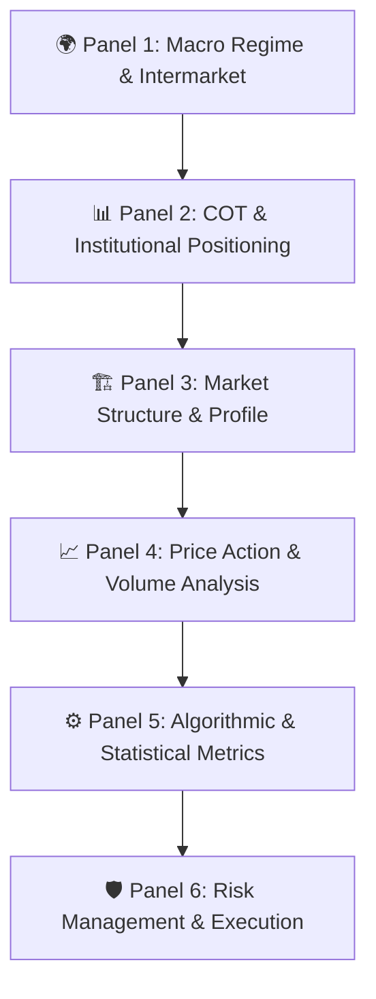
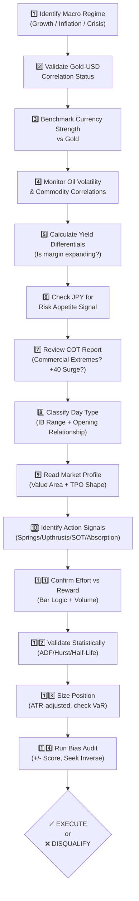

# Professional Trading Dashboard — Data Requirements Summary

> [!NOTE]
> Synthesized from all 8 base knowledge frameworks: Intermarket Analysis, Global Macro, Algorithmic Strategy, COT Intelligence, Market Profile, Auction Market Theory, VSA, and Weis-Wyckoff Method.

---

## Dashboard Architecture Overview

The dashboard is organized into **6 major panels**, flowing from macro context → micro execution. This mirrors the professional workflow: establish a top-down bias first, then drill down to precise entry/exit levels.

---

## Panel 1: Macro Regime & Intermarket Dashboard

**Purpose:** Establish the daily directional bias before any chart analysis.

### 1.1 — Regime Indicator
| Data Point | Source Framework | Why It Matters |
|---|---|---|
| **Current Regime Label** (Growth / Inflation / Crisis) | Global Macro | Determines which asset classes to favor and which to avoid |
| **Impossible Trinity Filter** | Global Macro | Shows which policy lever each central bank is prioritizing (Fixed FX, Free Capital, Independent Policy) |

### 1.2 — Gold-Dollar Correlation Monitor
| Data Point | Source Framework | Why It Matters |
|---|---|---|
| **Gold (XAU/USD) Price** — Live | Intermarket | Primary barometer of real-asset vs financial-asset preference |
| **DXY (US Dollar Index)** — Live | Intermarket | Anchor currency for all intermarket analysis |
| **Gold-USD Rolling Correlation** (30-day) | Intermarket | Normal = negative (~-0.84). Positive = "2005-style decoupling" alert |
| **Correlation Status Flag** | Intermarket | Visual alert: 🟢 Normal Inverse / 🔴 Decoupled (both rising) |

### 1.3 — Currency Strength Heatmap (Gold-Benchmarked)
| Data Point | Source Framework | Why It Matters |
|---|---|---|
| **Currency vs Gold Performance** (AUD, CAD, NZD, EUR, GBP, JPY, CHF, USD) | Intermarket | Strips "dollar noise" — shows TRUE secular strength |
| **Strongest / Weakest Pair Highlight** | Intermarket | "Pair the strongest with the weakest" for highest-probability setup |
| **JPY Strength Meter** | Intermarket | Risk-Off barometer — JPY rising = carry trade unwinding |

### 1.4 — Commodity & Energy Complex
| Data Point | Source Framework | Why It Matters |
|---|---|---|
| **WTI Crude Oil Price** — Live | Intermarket + Global Macro | Oil shocks trigger recessions and currency volatility |
| **CAD/WTI Correlation** | Global Macro | If commodity moves but correlated currency lags → macro dislocation trade |
| **Copper Price + Copper/Chilean Peso Correlation** | Global Macro | Industrial demand proxy; dislocation = high-probability entry |
| **Equity/Gold Ratio** | Intermarket | Secular sentiment — capital flowing to tangibles vs financials |

### 1.5 — Interest Rate & Yield Differentials
| Data Point | Source Framework | Why It Matters |
|---|---|---|
| **Fed Funds Rate** | Intermarket + Global Macro | Price of money |
| **ECB, BOJ, BOE, RBA Policy Rates** | Intermarket | Required for differential calculation |
| **Yield Differential Spread** (Fed vs each counterpart) | Intermarket | Currency rallies when its yield advantage is *expanding*, not just high |
| **US Yield Curve** (2Y/10Y Spread) | Global Macro | Inversion = recession signal |
| **Interest Rate Swap Rates** | Global Macro | Fixed Income "engine room" signal |

### 1.6 — Economic Calendar & Central Bank Monitor
| Data Point | Source Framework | Why It Matters |
|---|---|---|
| **Upcoming Data Releases** (GDP, CPI, NFP, ISM PMI) | Global Macro | High-frequency macro triggers |
| **Baltic Dry Index** | Global Macro | Global trade and industrial health gauge |
| **Central Bank Communication Schedule** | Global Macro | Avoid being caught on the wrong side of policy surprises |
| **QE / Balance Sheet Status** | Global Macro | Liquidity conditions backdrop |

---

## Panel 2: COT & Institutional Positioning

**Purpose:** Read the "footprints of the giants" — know what the Smart Money is doing before you place a trade.

### 2.1 — COT Index Dashboard
| Data Point | Source Framework | Why It Matters |
|---|---|---|
| **Commercial Net Position** (by market) | COT Intelligence | Smart Money positioning — they are 4x larger than Large Specs |
| **Large Speculator Net Position** | COT Intelligence | Trend-following money — often a contrarian indicator at extremes |
| **Small Trader Net Position** | COT Intelligence | "Dual personality" — max long at tops, max short at bottoms |
| **COT Index (36-month lookback)** | COT Intelligence | Normalizes current position within historical context |
| **COT Index (13-week lookback)** | COT Intelligence | Sensitive short-term sentiment shifts |
| **COT Movement Index** | COT Intelligence | Week-to-week change; **+40 point surge = aggressive institutional action** |

### 2.2 — Extreme Consensus Alerts
| Data Point | Source Framework | Why It Matters |
|---|---|---|
| **Commercial COT Index at 100%** (Max Bullish) | COT Intelligence | Primary setup for LONG positions |
| **Commercial COT Index at 0%** (Max Bearish) | COT Intelligence | Primary setup for SHORT positions |
| **Mirror Image Divergence** | COT Intelligence | When Commercials and Large Specs move in exact opposite directions |
| **Speculative Crowding Alert** | Global Macro + COT | CFTC positioning showing "crowded trades" = liquidity trap risk |

### 2.3 — Cross-Market COT Correlations
| Data Point | Source Framework | Why It Matters |
|---|---|---|
| **Energy COT → APA, PDS equities** | COT Intelligence | 96% Oil-to-stock correlation |
| **Metals COT → GLD, SLV** | COT Intelligence | Gold/Silver ratio validation |
| **Rates COT → TLT** | COT Intelligence | Yield curve shift signals |
| **Currency COT → Spot FOREX** | COT Intelligence | Leads trend changes in USD Index |

---

## Panel 3: Market Structure & Profile

**Purpose:** Classify the day type and identify Value — know WHERE the auction is and what type of day to expect.

### 3.1 — Market Profile (Steidlmayer Method)
| Data Point | Source Framework | Why It Matters |
|---|---|---|
| **TPO Profile** (current session) | Market Profile | Visual bell curve of price × time = Value |
| **Value Area (68% zone)** — VAH, VAL, POC | Market Profile | Zone of highest consensus / equilibrium |
| **Previous Day's Value Area** | Market Profile + AMT | Benchmark for "fair" — all activity gauged against this |
| **Profile Shape** (fat/horizontal vs thin/vertical) | Market Profile | Fat = balanced; Thin = seeking new value |
| **Single Prints / Tails** | Market Profile | Lack of conviction or vacuum areas |
| **Excesses / Blow-Off Extremes** | Market Profile | Definitive auction boundaries for risk placement |
| **Auction Points** | Market Profile | Where the auction fully tested and reversed |

### 3.2 — Day Type Classification
| Data Point | Source Framework | Why It Matters |
|---|---|---|
| **Detected Day Type** (Normal, Normal Variation, Trend, Double-Distribution, Nontrend, Neutral) | AMT | Determines strategy: mean-revert, trend-follow, or sit out |
| **Initial Balance Range** (first hour high/low) | AMT | Benchmark for range extension expectations |
| **Range Extension Count** (above/below IB) | AMT | Measures "Other Timeframe" conviction |

### 3.3 — Opening Analysis
| Data Point | Source Framework | Why It Matters |
|---|---|---|
| **Opening Relationship** (Within Value / Outside Value / Gap) | AMT | Primary gauge of daily sentiment |
| **Value Area Rule Status** | AMT | If opens outside VA then re-enters → 80% chance it trades through to opposite side |
| **Gap Status & Direction** | AMT | Highest conviction signal — potential Trend Day |

### 3.4 — Volume Area Analysis
| Data Point | Source Framework | Why It Matters |
|---|---|---|
| **High-Volume Nodes** (HVN) | AMT | "Fair value" magnets — expect consolidation |
| **Low-Volume Nodes** (LVN) | AMT | Rejection zones — price moves through fast |
| **Initiative vs Responsive Activity Flag** | Market Profile + AMT | Who is in control? Institutional push or mean-reversion pull? |

---

## Panel 4: Price Action & Volume Analysis

**Purpose:** Read the micro-narrative — bar-by-bar and wave-by-wave — to time precise entries.

### 4.1 — Weis-Wyckoff Structural Lines
| Data Point | Source Framework | Why It Matters |
|---|---|---|
| **Support / Resistance Lines** | Weis-Wyckoff | Horizontal boundaries of the trading range |
| **Ice Line** (range floor) | Weis-Wyckoff | Breaking the ice = structural shift |
| **Axis Lines** | Weis-Wyckoff | Levels that flip from support ↔ resistance |
| **Trend Channels** (Demand/Supply lines) | Weis-Wyckoff | Dynamic S/R — the angle of the trend |
| **Reverse Trend Channel** | Weis-Wyckoff | Exhaustion alert when surpassed |
| **Converging Lines / Apex** | Weis-Wyckoff | Maximum compression → imminent breakout |

### 4.2 — Action Signals
| Data Point | Source Framework | Why It Matters |
|---|---|---|
| **Springs** (false breakdowns) | Weis-Wyckoff + VSA | Bullish reversal setup at range floor |
| **Upthrusts** (false breakouts) | Weis-Wyckoff + VSA | Bearish reversal setup at range ceiling |
| **Shortening of Thrust (SOT)** | Weis-Wyckoff | Measurable metric of trend exhaustion |
| **Absorption Zones** | Weis-Wyckoff + VSA | High volume + little price progress = ownership transfer |
| **Tests** (return to high-volume area on low volume) | Weis-Wyckoff | Confirms supply/demand depletion |
| **Hinge / Dead Center** | Weis-Wyckoff | Maximum compression — precursor to vertical move |

### 4.3 — Bar-by-Bar Reading (Effort vs Reward)
| Data Point | Source Framework | Why It Matters |
|---|---|---|
| **Bar Spread** (wide/narrow) | VSA + Weis-Wyckoff | Wide = ease of movement; Narrow = absorption/change |
| **Close Position** (high/mid/low of bar) | VSA + Weis-Wyckoff | Tells who won the bar — buyers or sellers |
| **Volume per Bar** | VSA + Weis-Wyckoff | Effort metric |
| **Effort vs Reward Matrix** | VSA | High effort + low reward = trend change signal |
| **Key Reversal Detection** | Weis-Wyckoff | Vacuum signal — no further selling interest |

### 4.4 — Technical Indicators (Confirmation Layer)
| Data Point | Source Framework | Why It Matters |
|---|---|---|
| **Moving Averages** (trend direction) | Global Macro | Primary trend identification |
| **RSI** | Global Macro | Overextended price detection |
| **MACD** | Global Macro | Momentum and crossover signals |
| **Stochastics** | Global Macro | Overbought/oversold confirmation |
| **Fibonacci Retracements** | Global Macro | Rhythmic price targets |
| **SMC (Smart Money Concepts)** | Indicator (smc.pine) | Order blocks, fair value gaps, liquidity sweeps |

---

## Panel 5: Algorithmic & Statistical Metrics

**Purpose:** Validate the setup mathematically — ensure the edge is real, not hallucinated.

### 5.1 — Mean Reversion Metrics
| Data Point | Source Framework | Why It Matters |
|---|---|---|
| **ADF Test (λ coefficient)** | Algorithmic Strategy | Negative λ = mean-reverting; Positive λ = abandon immediately |
| **Hurst Exponent (H)** | Algorithmic Strategy | H < 0.5 = mean reversion; H = 0.5 = random walk |
| **Half-Life of Mean Reversion** | Algorithmic Strategy | Determines trade duration and capital efficiency |
| **Variance Ratio** | Algorithmic Strategy | Statistical significance of diffusion rate |

### 5.2 — Cointegration & Pairs Status
| Data Point | Source Framework | Why It Matters |
|---|---|---|
| **Cointegration Status** (for active pairs) | Algorithmic Strategy | Is the pair still cointegrated? |
| **Dynamic Hedge Ratio** (updated daily) | Algorithmic Strategy | Fixed ratios fail — must recalculate |
| **Z-Score of Spread** | Algorithmic Strategy | Entry/exit signal for mean-reversion pairs |
| **Johansen Eigenvectors** | Algorithmic Strategy | Multi-asset cointegration relationships |

### 5.3 — Strategy Validation
| Data Point | Source Framework | Why It Matters |
|---|---|---|
| **Sharpe Ratio** (realized) | Algorithmic Strategy + Global Macro | Risk-adjusted return metric |
| **Sortino Ratio** | Global Macro | Downside-risk-adjusted return |
| **Monte Carlo Confidence Level** | Algorithmic Strategy | Is the alpha real or lucky? |

---

## Panel 6: Risk Management & Execution Control

**Purpose:** Every trade must pass through the risk gate before execution.

### 6.1 — Position Sizing
| Data Point | Source Framework | Why It Matters |
|---|---|---|
| **ATR (Average True Range)** | Global Macro | Volatility-adjusted position sizing |
| **Volatility-Adjusted Unit Size** | Global Macro | Higher ATR → smaller size to keep dollar-risk constant |
| **Value at Risk (VaR)** | Global Macro + Algorithmic | Portfolio-level risk exposure |
| **Current Risk Utilization %** | Global Macro | Must stay within prescribed limits |

### 6.2 — Trade Quality Scorecard
| Data Point | Source Framework | Why It Matters |
|---|---|---|
| **Bias Audit Score** (+/- factors logged) | Global Macro | If negatives > positives → trade is disqualified |
| **Confirmation Bias Check** | Global Macro | Have you sought the inverse argument? |
| **Liquidity & Gap Risk Assessment** | Global Macro | Can you exit during a shock event? |

### 6.3 — Two Big Questions (Always Visible)
| Data Point | Source Framework | Why It Matters |
|---|---|---|
| **"Which way is the market trying to go?"** | AMT | Answered by Structure (price attempts + range extension) |
| **"Is it doing a good job getting there?"** | AMT | Answered by Volume + Range Extension quality |

---

## Pre-Market Checklist (Composite from All Frameworks)

This is the **master workflow** that synthesizes every panel into a single decision tree:

---

## Markets to Avoid (Hard Rules)

> [!CAUTION]
> Never trade these conditions regardless of how compelling the setup appears:

| Condition | Source | Reason |
|---|---|---|
| **Nontrend Days** | AMT | No range, no opportunity — pure churn |
| **Nonconviction Days** | AMT | No "Other Timeframe" control visible |
| **News-Influenced Markets** | AMT | External noise > natural auction. Math doesn't favor you |
| **Crowded COT Trades** | COT + Global Macro | Liquidity trap risk — stop-runs likely |
| **Positive λ (ADF)** | Algorithmic | Series is trending/diverging — mean-reversion = "catching a falling knife" |

---

## Summary: Total Data Points Count

| Panel | # of Unique Data Points |
|---|---|
| 1 — Macro Regime & Intermarket | ~22 |
| 2 — COT & Institutional Positioning | ~14 |
| 3 — Market Structure & Profile | ~16 |
| 4 — Price Action & Volume Analysis | ~22 |
| 5 — Algorithmic & Statistical Metrics | ~10 |
| 6 — Risk Management & Execution | ~8 |
| **Total** | **~92 data points** |

> [!TIP]
> The dashboard should flow **left-to-right** or **top-to-bottom** following the decision tree: Macro Context → Positioning Intelligence → Market Structure → Price Action → Statistical Validation → Risk Gate → Execute/Disqualify.
