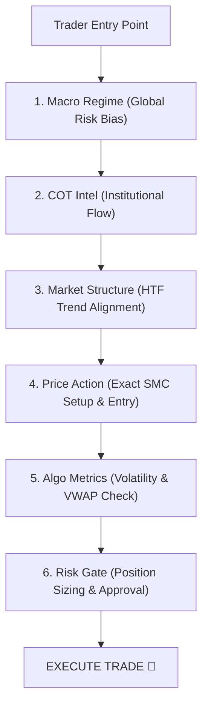

# shadcn/ui FinTech Redesign & Trader Use-Case Plan

## Goal & Problem Statement
The user reported that the current UI is cluttered and hard to read ("ดูไม่รู้เรื่องเลย"). 
This plan rebuilds the **TradeSetup** user interface using clean **shadcn/ui design patterns** (card structures, tabs, metrics, status badges, clean typography hierarchy, high-contrast dark theme) and reorganizes every screen around **real trader use-cases and decision workflows**.

---

## Page-by-Page Trader Use Case & UX Redesign

### 1. Macro Regime Page (`src/pages/MacroPanel.tsx`)
- **Trader Use Case**: "วันนี้ตลาดโลกอยู่ในสภาวะ Risk-On หรือ Risk-Off? ควรมองฝั่ง Buy หรือ Sell ในภาพใหญ่?"
- **UX Redesign**:
  - **Hero Decision Banner**: Large, unmistakable status card (e.g., `BULLISH GROWTH REGIME`) with 3 key reasons.
  - **Key Economic Indicators Grid**: 4 clean shadcn-style Metric Cards (Fed Rates, 2Y/10Y Spread, CPI Inflation, Fed Balance Sheet).
  - **Intermarket Correlation Card**: Gold vs DXY relationship with clear explanation of what it means for today's trade.
  - **Currency Matrix**: Simplified 8-currency strength cards with clear Rank (1st -> 8th).

### 2. COT Intel Page (`src/pages/CotPanel.tsx`)
- **Trader Use Case**: "ขาใหญ่ (รายใหญ่/สถาบัน/Hedge Funds) กำลังสะสม L (Long) หรือ S (Short) ในสินทรัพย์นี้?"
- **UX Redesign**:
  - **Smart Money Gauge**: Visual percentile meter showing whether Hedge Funds are at extreme long or short levels.
  - **Asset Tabs**: Quick tabs (`Gold (XAUUSD)`, `US Dollar (DXY)`, `Euro (EURUSD)`, `S&P 500`).
  - **Position Breakdown Table**: Clean table showing Commercial Hedgers vs Non-Commercial Speculators with clear Net Long/Short badges.

### 3. Market Structure Page (`src/pages/StructurePanel.tsx`)
- **Trader Use Case**: "เทรนด์ของภาพใหญ่ (Monthly -> H4) ไปทางเดียวกันไหม? มี Break of Structure (BOS) ตรงไหน?"
- **UX Redesign**:
  - **Multi-Timeframe Alignment Status**: 5-step timeline (MN -> W1 -> D1 -> H4 -> H1) showing green checkmarks for aligned timeframes.
  - **Liquidity Targets**: Clear cards separating Buy-Side Liquidity (BSL) and Sell-Side Liquidity (SSL).
  - **Structural Level Summary**: Key swing high/low price levels.

### 4. Price Action (SMC) Page (`src/pages/PriceActionPanel.tsx`)
- **Trader Use Case**: "จุดเข้าเทรด (Entry), จุดตัดขาดทุน (SL), และจุดทำกำไร (TP) ที่คมที่สุดอยู่ตรงไหน?"
- **UX Redesign**:
  - **Featured Setup Card**: Highlighted A+ setup card with big Entry/SL/TP numbers and R:R ratio.
  - **Interactive Setup List**: Cards for Order Block (OB) touches and Fair Value Gap (FVG) fills.
  - **Trigger Checklist**: 4-point confirmation list before pulling the trigger.

### 5. Algo Metrics Page (`src/pages/AlgoPanel.tsx`)
- **Trader Use Case**: "ตอนนี้ความผันผวน (ATR) เป็นอย่างไร? ราคาแพงไปหรือถูกไปด้วย VWAP Standard Deviation?"
- **UX Redesign**:
  - **Volatility Thermometer**: ATR gauge showing if volatility is Low, Normal, or High (Dangerous).
  - **VWAP Band Table**: Overbought (+2σ), Fair Value (VWAP), Oversold (-2σ) price levels.
  - **Volume Profile Zones**: High Volume Nodes (HVN) vs Point of Control (POC).

### 6. Risk Gate Page (`src/pages/RiskPanel.tsx`)
- **Trader Use Case**: "ฉันควรออกหลอด (Lot Size) เท่าไหร่ถึงจะไม่ล้างพอร์ต? ผ่านเงื่อนไขความเสี่ยงไหม?"
- **UX Redesign**:
  - **Position Size Calculator**: Large, clean input fields for Account Balance, Risk %, Entry, SL -> Big output for **Lot Size**.
  - **Pre-Trade Compliance Checklist**: 4 mandatory safety passes.
  - **Daily Loss Circuit Breaker**: Clear visual bar of max daily drawdown remaining.

---

## Layout & Design System Upgrade (shadcn/ui Pattern Alignment)
1. **Clean Card Architecture**: Use `Card`, `CardHeader`, `CardTitle`, `CardDescription`, `CardContent` layout structure.
2. **Tab Navigation**: Clean horizontal tabs (`Tabs`, `TabsList`, `TabsTrigger`, `TabsContent`).
3. **Badges & Indicators**: High-contrast, easily scannable pill badges (`Badge`).
4. **Scannable Typography**: Large bold headers, readable muted subtitles, font-mono tabular figures for numbers.

---

## Verification Plan
1. **TypeScript Build Check**: `npx tsc --noEmit` must pass with 0 errors.
2. **Local Preview Check**: Verify all 6 pages render smoothly without clutter.
