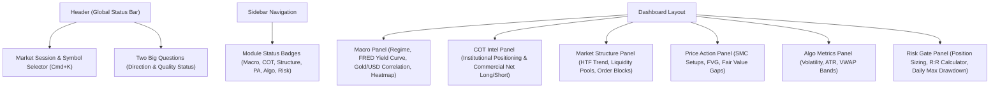

# FinTech UX/UI Transformation Plan (TradeSetup Dashboard)

## Executive Summary
This plan upgrades the **TradeSetup** trading dashboard to top-tier FinTech standards (Robinhood, Bloomberg Terminal, Wealthfront, TradingView level). It applies WCAG 2.2 AA accessibility, data-density design, institutional dark mode aesthetics, trust-building patterns, and tabular number formatting.

---

## FinTech UX/UI Design Principles Applied
1. **Trust & Data Transparency**: Last updated timestamps, live market status (NY/LDN/Tokyo sessions), data source badges, and clear units.
2. **Number-Heavy UI & Tabular Figures**: Monospace numbers (`tabular-nums`), explicit sign indicators (`+` / `-`), and financial color semantics (Emerald for gain, Rose for loss, Amber for warning).
3. **Accessibility (WCAG 2.2 AA)**: High contrast ratio (>4.5:1), screen-reader friendly status icons (never color alone), and visible keyboard focus states.
4. **Instant Visual Impact**: Rich interactive panels, glassmorphism card elevation, animated metric pulses, and zero raw placeholder text across all 6 core dashboard views.

---

## Architecture & Component Enhancements

---

## Detailed Implementation Phases

### Phase 1: Core Design System & Tokens Upgrade (`src/index.css`)
- **Tokens**: Refine glassmorphism background filters, active borders, status glows (`emerald-500/20`, `rose-500/20`, `indigo-500/20`).
- **Typography & Tabular Figures**: Add `.tabular-nums` helper and font scale for financial metrics.
- **Micro-animations**: Smooth status pulse dots, card hover depth (`translateY(-2px)`), shimmer skeletons.

### Phase 2: High-Trust Header & Quick Action Bar (`src/components/layout/Header.tsx`)
- Add **Live Market Session Status** (e.g., `🟢 NY Session Open | London Closed`).
- Enhance **Two Big Questions** status with tooltip explanations & confidence score badges (e.g., `Direction: UP (85% Conf)`, `Quality: HIGH (A+)`).
- Add **Symbol Quick Search** input with keyboard shortcut hint (`⌘K`).
- Add **Data Freshness Indicator** (e.g., `Updated 2s ago`).

### Phase 3: Interactive Sidebar with Live Status (`src/components/layout/Sidebar.tsx`)
- Add active signal count badges per panel (e.g., `Macro: Bullish 🟢`, `COT: Heavy Long 🟢`, `Risk: Pass ✅`).
- Improve active navigation highlighting with glow rings and responsive mobile collapsed state.

### Phase 4: Macro Regime & Intermarket Panel (`src/pages/MacroPanel.tsx`)
- Upgrade **Regime Card**: Add 4-state indicator (Growth / Inflation / Stagflation / Liquidity Crunch) with detailed drivers.
- Upgrade **Gold-USD Correlation Widget**: Rechart-style SVG/interactive visual curve showing inverse correlation with live tooltip values.
- Upgrade **Yield Curve & Fed Rate Widget**: Display 2Y/10Y spread with Recession Warning Status.
- Upgrade **Currency Strength Heatmap**: Grid displaying 8 major currencies with color-coded % change and tabular figures.

### Phase 5: Complete All 5 Missing Sub-Panel UIs
1. **COT Intel Panel (`src/pages/CotPanel.tsx`)**:
   - Commercial vs Non-Commercial Net Positioning bar charts.
   - COT Index percentile gauge (Bullish/Bearish extreme indicators).
2. **Market Structure Panel (`src/pages/StructurePanel.tsx`)**:
   - Multi-timeframe trend alignment matrix (MN, W1, D1, H4, H1).
   - Liquidity Pools & Swing High/Low levels table.
3. **Price Action Panel (`src/pages/PriceActionPanel.tsx`)**:
   - Smart Money Concepts (SMC) Setup cards (Order Block, Fair Value Gap FVG, Liquidity Grab).
4. **Algo Metrics Panel (`src/pages/AlgoPanel.tsx`)**:
   - ATR (Average True Range) volatility gauge, VWAP Deviation bands, Volume Profile status.
5. **Risk Gate Panel (`src/pages/RiskPanel.tsx`)**:
   - Interactive Position Size Calculator, Risk-to-Reward (R:R) validator, Max Daily Loss guard.

---

## Verification Plan
1. **Visual & Design Inspection**: Ensure all cards follow FinTech aesthetic guidelines, dark mode tokens, and smooth glassmorphism.
2. **Interactive Navigation**: Verify smooth switching between all 6 dashboard views without any broken or plain placeholder screens.
3. **Build Check**: Run `bun run build` / `npm run build` to verify zero TypeScript or bundle errors.
