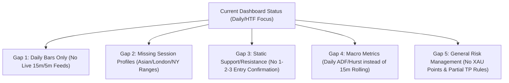
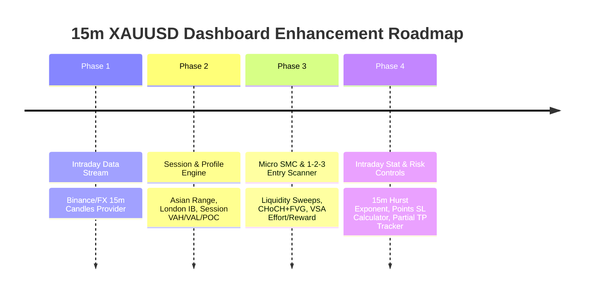

# Plan: Dashboard Enhancements for XAUUSD 15-Minute Timeframe Trading

> [!NOTE]
> Grounded in the 8 Trading Knowledge Base Frameworks (`brain/`), specifically `brain/trade-setup.md` (XAUUSD High Elite FX Strategy), `brain/Market Profile Trade.md`, `brain/The Auction Market Theory Framework.md`, `brain/Volume Spread Analysis (VSA).md`, `brain/Weis-Wyckoff Method.md`, and `brain/Algorithmic Strategy Framework.md`.

---

## Executive Summary

To trade **XAUUSD (Gold) on the 15-minute timeframe (15m)** effectively, the dashboard requires specific intraday capabilities. Gold on 15m is characterized by **80% sideway / liquidity sweeps** and **20% strong expansion trends**, heavily driven by Forex/Commodity sessions (Asian, London, NY) and high-impact USD economic events.

Currently, the dashboard provides a solid daily macro/COT structure. However, to execute high-precision 15m intraday setups, several enhancements are required across data infrastructure, session profiling, micro-structure pattern detection, statistical regime filters, and position sizing.

---

## Current Architecture vs 15m Trading Gap Analysis

---

## Detailed Improvement Plan

### 1. Data Infrastructure — Real-time Intraday Data Stream (15m / 5m)
* **Current Issue:** `src/services/marketDataProvider.ts` only fetches daily bars (`1d`, `1wk`, `1mo`). Interval `'1h'` uses dummy daily bar proxies.
* **Required Enhancement:**
  * Integrate real-time intraday candle feeds for XAUUSD (via Binance REST/WebSocket `PAXGUSDT` / `XAUUSDT` or FX intraday providers).
  * Build 15m, 5m, and 1m bar aggregators in `marketDataProvider.ts` to power intraday indicators.

---

### 2. Session Profiling & Initial Balance (AMT & Market Profile Framework)
* *Knowledge Source:* `brain/Market Profile Trade.md` & `brain/The Auction Market Theory Framework.md`
* **Required Enhancements:**
  * **Session Range Indicators:**
    * **Asian Session Range (00:00 – 07:00 UTC):** Display Asian High & Low as primary Liquidity Targets (BSL/SSL).
    * **London Initial Balance (IB - First 1 Hour):** Calculate London High/Low, Value Area High (VAH), Value Area Low (VAL), and Point of Control (POC).
    * **NY Session Overlap Alert (12:00 – 17:00 UTC):** Highlight high-volatility trading window.
  * **Opening Relationship & Day Type Classification:**
    * Detect whether 15m price opens inside or outside the previous session's Value Area.
    * Flag Day Type: *Trend Day*, *Normal Variation Day*, or *Non-Trend Day* (Do Not Trade).

---

### 3. Micro-Structure & 1-2-3 Entry Engine (XAU Mastery & VSA Framework)
* *Knowledge Source:* `brain/trade-setup.md`, `brain/Volume Spread Analysis (VSA).md`, & `brain/Weis-Wyckoff Method.md`
* **Required Enhancements:**
  * **Liquidity Sweep Detector (Spring & Upthrust):**
    * Detect false breakouts of Asian High/Low, Previous Day High/Low (PDH/PDL), or Equal Highs/Lows (EQH/EQL).
  * **1-2-3 Entry Confirmation Engine:**
    * **Step 1 (Break):** 15m/5m CHoCH with displacement leaving Fair Value Gap (FVG).
    * **Step 2 (Retest):** Price retraces back into Order Block (OB) / FVG / Liquidity Sweep Zone.
    * **Step 3 (Reject):** Confirming rejection candle (Pinbar, Engulfing, or No Supply / No Demand bar).
  * **Clean Traffic (CT=CT) Highlighting:**
    * Flag left-side imbalance zones where 15m price can run rapidly without obstacles.
  * **VSA Effort vs. Reward Meter (15m):**
    * Measure Volume relative to Bar Spread to detect **Absorption** or **Shortening of Thrust (SOT)** at key POIs.

---

### 4. Intraday Statistical Validation (Algorithmic Framework)
* *Knowledge Source:* `brain/Algorithmic Strategy Framework.md`
* **Required Enhancements:**
  * **15m Rolling Hurst Exponent ($H$):**
    * Calculate Hurst Exponent over a rolling 100-bar window on 15m.
    * **$H < 0.5$ (Mean Reversion):** Trigger Mean-Reversion Mode $\rightarrow$ favor Spring/Upthrust entries back toward POC/VWAP.
    * **$H > 0.5$ (Trending):** Trigger Momentum Mode $\rightarrow$ favor Break & Retest of IB/Clean Traffic zones.
  * **15m VWAP & Standard Deviation Bands ($\pm 1\sigma, \pm 2\sigma$):**
    * Anchor VWAP to session opens (Asian/London/NY) for institutional mean-reversion targets.

---

### 5. Risk Management & Execution Control for XAUUSD
* *Knowledge Source:* `brain/trade-setup.md`
* **Required Enhancements:**
  * **Points / Pips Volatility Converter:**
    * Convert percentage risk into XAUUSD **Points** (e.g., 300–500 points SL buffer beyond liquidity wick).
    * Calculate exact Lot Size based on account balance, target SL in points, and current 15m ATR.
  * **70–80% Partial Close & Risk-Free Manager:**
    * Trigger alert when price reaches **1:1 or 1:1.5 RR** to execute 70–80% Partial Close and move SL to Breakeven (Bonus Trade).
  * **Sub-Account Risk Allocation (Port B/C/D):**
    * Provide a separate risk budget allocation module for high-R:R intraday 15m setups vs core macro portfolio.

---

### 6. High-Impact News Catalyst Shield
* *Knowledge Source:* `brain/Global Macro Framework.md`
* **Required Enhancements:**
  * Real-time Economic Calendar integration (USD Red Folder Events: CPI, NFP, FOMC, ISM PMI).
  * **Auto-Lockdown Alert:** Warn and pause 15m entry signals 15 minutes before and after high-impact news releases.

---

## Action Plan Roadmap

---

## Verification & Testing Criteria

1. **Intraday Data Accuracy:** Verify 15m OHLCV candle updates against live market feeds.
2. **Session Boundaries:** Test accurate plotting of Asian Range and London Initial Balance.
3. **Pattern Signal Precision:** Backtest 1-2-3 Entry Confirmation and Liquidity Sweeps on historical 15m XAUUSD data.
4. **Risk Calculations:** Validate lot size calculations for 300–500 point SL scenarios.
